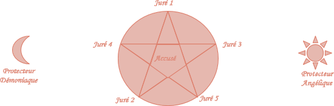

<!----- Conversion time: 0.467 seconds.

Using this Markdown file:

1. Cut and paste this output into your source file.
2. See the notes and action items below regarding this conversion run.
3. Check the rendered output (headings, lists, code blocks, tables) for proper
   formatting and use a linkchecker before you publish this page.

Conversion notes:

* Docs to Markdown version 1.0β17
* Sat Nov 30 2019 07:15:52 GMT-0800 (PST)
* Source doc: https://docs.google.com/open?id=1tVG7xBwbUcoWvRLrB_FrZwdg2qSjHavBbKh17Zx9tdA
----->

## Rituel du Juge et du Bourreau

Ce rituel a pour but d’invoquer le Juge et le Bourreau, afin de permettre à l’Accusé d’être acquitté.

Sorciers, Sorcières, prenez garde en commençant ce rituel , ce qui est commencé doit être fini, car ce Rituel et son but impie attire le courroux des Anges, dont le Jugement ne doit pas être remis en cause, et des Démons, à qui l’on ne doit pas dérober d’Âme. Seul l’accomplissement du Rituel préservera les Jurés du Juste et de l’Injuste Courroux.

N’oubliez pas, le Juge est aveugle, et le Bourreau assoiffé de Sang. L’un ne partira pas sans rien dire, l’autre ne partira pas sans rien exécuter.

### Commencement du Rituel

Les sorciers et sorcières se place en cercle autour du pentacle. Ils doivent être vêtus de capirote, afin que leurs corps forment des flèches vers le ciel.

Le Rituel débute dès qu’ils ferment, puis rouvrent les yeux.

**Note aux  Adeptes :** Si vous utilisez des collaborateurs dénués de volonté propre ou non consentants (quelque soit le moyen de Coercition utilisé), ils peuvent avoir une perte de mémoire au moment d’ouvrir les yeux. Celle-ci s’étend, en général, depuis le moment où le collaborateur concerné a perdu son libre-arbitre. Elle peut s’étendre au delà. La durée de l’amnésie est variable, et parfois définitive. De même, le Rituel commandant aux Forces Supérieurs, tout effet magique est dissipé au Commencement.

Prenez garde à la réaction des participants non consentants ! Le Rituel aura commencé, et un funeste sort vous attends si vous n’arrivez pas à reprendre la barre.

### Le Temps de l’Appel

En fonction de la Puissance des Exécutants, les Légions et les Hordes mettront plus ou moins de temps pour fondre sur eux. C’est pourquoi les plus puissants Mages font appel à des exécutants de moindre force : afin de gagner du temps avant l’Appel, et s’assurer que tout soit en place avant l’arrivée des Forces.

Bien sûr, l’utilisation de non-initiés représente un avantage non négligeable sur ce point. Cependant, ils seront aussi plus difficile à convaincre, et risquent de perdre leurs moyens au moment crucial, ce qui représente un danger en soit. Or, rares sont les Conjurateurs capables de réaliser un charme d’envoûtement résistant à Leurs Regards, et encore moins à Leurs Venues.

### Accomplissement du Rituel

Aucun participant du Tribunal ne doit être masqué.

L’Accusé est placé dans le pentagone au centre du pentacle. Les jurés se placent à chacune des pointes du pentacle, sur le cercle.

Les protecteurs Angéliques et Démoniaques, ceux qui ont été choisi pour retenir les Légions et les Hordes qui s’opposeront au Jugement doivent prendre place à l’Est et à l’Ouest, respectivement.

Une fois tous les participants en place, prononcez la phrase Rituel :

Iudex et carnificis,

Homicida, et reus

Vocamus ipsos venire faceret.

Le Juge et le Bourreau apparaîtrons, mais les Légions et les Hordes seront également appelé. Si votre protecteur Angélique et votre protecteur Démoniaque ne sont pas capable de les retenir, ils atteindront les Jurés, de proche en proche.

### Le Jugement

Le Juge interrogera les Jurés, et prononcera son jugement en fonction de Leurs Avis. Le Bourreau ne repartira pas sans avoir assouvi sa soif.

Seul ceux présents dans le cercle peuvent être désignés.

### Choix des Conjurés

Traditionnellement, les Jurés sont choisis en fonction de leur Nature. Les plus purs se mettent du coté des Anges, les plus impurs se mettent du coté des Démons. Les Jurés 2 et 3 seront ceux qui seront les premiers soumis aux Hordes si l’un des Protecteurs est défaillant. Respecter les traditions permet de parer à ce genre d’imprévu.

Le Juré 5 est le plus neutre et aussi le premier et le dernier interrogé par le Juge. Lui seul peut changer son avis avant que le Juge ne rende son Jugement.

Les Protecteurs doivent être en phase avec ceux qu’ils retiennent. 

Le Protecteur Angélique doit être de préférence un être tourné vers les autres, mais un être en quête de rédemption peut également faire l’affaire. Le mieux est quand même d’avoir un Ange Incarné, mais il est difficile d’obtenir un tel soutien.

Le Protecteur Démoniaque doit être de préférence un homme tourné vers lui-même, ne se souciant pas vraiment des autres. A défaut une personne incapable de se remettre en question peut-être une solution, car ce genre d’engeance est vouée à l’Enfer. Le mieux (ou le pire, tant cela est périlleux) est d’avoir un Démon Incarné, mais ce genre de créature est versatile par essence.

<!-- Docs to Markdown version 1.0β17 -->
